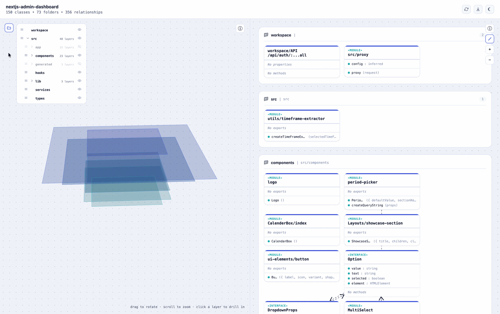

# kratai - know your code

> An interactive, always up-to-date architecture diagram for your codebase.

kratai turns your codebase into an **interactive, up-to-date architecture diagram** — a 3D Stack Layer view and a 2D Class Diagram, generated entirely by static analysis (no LLM calls, no hallucinations, always reflects the real code). Open it as a native desktop app or a local web view, and use it to actually understand a system, review what changed, or explain your architecture to a teammate, a lead, or a client.



---

## ✨ Key Features

### 🖥️ **Desktop app**

- **A native window, not a browser tab** — opens straight into your project, remembers your recently-opened workspaces, and picks up local file-open dialogs (`Cmd+O`) like any other Mac/Windows/Linux app.
- **Same engine as the CLI** — the desktop app is a thin native shell around the exact same local view server `kratai view` runs, so there's one UI to trust, not two implementations to keep in sync.

### 📊 **Architecture Intelligence**

- **Deterministic Analysis** — Generate interactive architecture diagrams directly from your codebase using static analysis. No LLM tokens required, no hallucinations, always reflects the actual code structure.
- **Single Source of Truth** — Diagrams represent the real state of your system, making it easy to understand the overall architecture and to explain it to someone else.
- **Developer-Friendly Navigation** — Git diff highlighting shows uncommitted changes at a glance, right in the diagram.

### 🌐 **`kratai view` — the same explorer, from the command line**

- **Two synchronized views** — a 3D **Stack Layer** view (each folder as a drillable, stackable sheet) and a 2D **Class Diagram** (UML-style boxes with typed relationships). Side by side on a wide screen, switchable one at a time on a narrow one.
- **Real folder structure, not a guess** — the navigation panel mirrors your actual folder tree. Purely organizational folders (no code of their own) are still shown, just dimmed by default, and drilling into one auto-expands through the whole wrapper chain to real content in a single click.
- **Full control over what's shown** — hide, show, reorder (drag), and drill down into any folder from either view; state persists across reloads and stays in sync between both views.
- **Refresh without restarting** — re-scans the whole project from disk on demand, no need to kill and restart the server after you change code.
- **Dark and light themes**, matching your system by default.
- **One-click Markdown export** of the whole architecture, for pasting into a PR description or a doc.

---

## 📸 Visual Tour

<!--
TODO: recapture screenshots against the current desktop app / `kratai view`
and drop them into demo/ under these filenames, or update the paths below to
match whatever you capture. Suggested shots:
  1. demo/demo_stack_layer.png   - the 3D Stack Layer view, a few folders drilled in
  2. demo/demo_class_diagram.png - the Class Diagram view with a git-diff-highlighted change
  3. demo/demo_folder_panel.png  - the shared folder panel (hide/show/reorder/drill)
  4. demo/demo_split.png         - both views side by side on a wide window
-->

### 1. A Native Window Into Your Codebase
The desktop app opens straight into your project and shows Stack Layer + Class Diagram side by side on a wide window.

### 2. Explore Your Architecture Interactively
Drill into folders, follow relationships, and see uncommitted changes highlighted directly in the diagram.

### 3. Full Control Over What's Shown
Hide, show, reorder, and drill into any folder from the shared navigation panel — in either view, with state that persists across reloads.

---

## 🚀 Getting Started

### CLI (no install)

```bash
npx @kratai/cli view      # live interactive diagram in your browser
npx @kratai/cli analyze   # Markdown architecture summary, e.g. for a PR description
```

### Desktop app

No packaged binaries yet — for now, build and run it from source:

```bash
git clone https://github.com/kratai-desci/kratai.git
cd kratai
npm install
npm run dev --workspace=packages/desktop
```

---

## 📦 Repository Structure

```
packages/
├── analysis/      analysis engine + diagram-spec generator (deterministic, zero LLM calls)
├── diagram-view/  the interactive class diagram renderer, shared by cli and desktop
├── cli/           kratai analyze / kratai view - installable CLI, also exports runView as a library
└── desktop/       Electron desktop app - a native window around the same view server `kratai view` runs
```

---

## 🌐 Supported Languages & Frameworks

| Language | Support | Framework Enrichment |
|---|---|---|
| **TypeScript** | ✅ Full | Next.js (components, types, API calls) |
| **JavaScript** | ✅ Full | Next.js (JSX rendering) |
| **Python** | ✅ Full | Django (views, templates, ORM, DRF) |
| **Java** | ✅ Full | Spring Boot (MVC, JPA, REST, DI) |
| **PHP** | ✅ Full | Laravel/Symfony (planned) |

**Framework-specific features** automatically detect patterns like:
- **Spring Boot:** Controller→View (JSP/Thymeleaf), JPA relationships, REST endpoints, dependency injection
- **Django:** View→Template, ORM relationships, REST Framework
- **Next.js:** Component rendering, type usage, fetch() detection


---

## 📝 Release Notes

### Latest: v2.0 (2026-08-24)
- 🖥️ **New: `kratai view`** — a full interactive architecture explorer replaces the old VS Code webview config panel. Two synchronized views (3D Stack Layer + Class Diagram), a shared folder navigation panel, dark/light theming, and git-diff highlighting, all served locally with no editor dependency.
- 🗂️ **Folder panel redesign** — the navigation tree now mirrors your real folder structure instead of collapsing organizational folders away; empty wrapper folders default to hidden and auto-expand through in one click when you drill in.
- 🔄 **Refresh without restarting** — re-scan the whole project from disk on demand instead of killing and restarting the server.
- 🧹 **CLI-first** — the VS Code extension and its MCP server have been removed entirely; kratai is now a standalone CLI (`kratai analyze` / `kratai view`).

See [CHANGELOG.md](CHANGELOG.md) for full release history.

---

## 🔗 Links

- 🌐 [Website](https://kratai.com)
- 📦 [GitHub Repository](https://github.com/kratai-desci/kratai)
- 🐛 [Report an Issue](https://github.com/kratai-desci/kratai/issues)
- 💬 [Community Discussions](https://github.com/kratai-desci/kratai/discussions)
- 🤝 [Contributing Guide](CONTRIBUTING.md)

---

**Made with ❤️ by the kratai team** | [MIT License](LICENSE) | [CLA](CLA.md)
