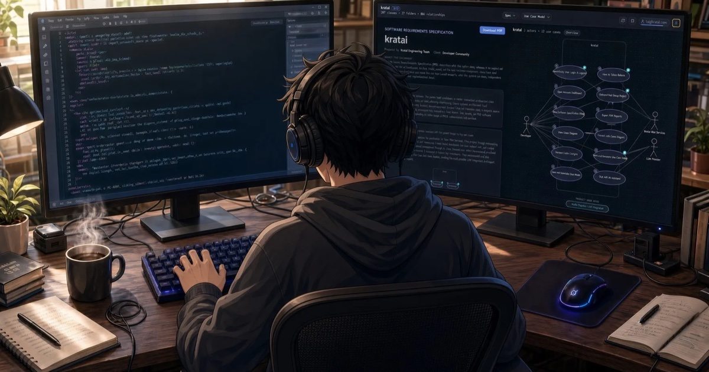

# kratai — Build the Right Thing

*with the SDD Toolkit*

kratai is an AI-native, visual toolkit for Spec-Driven Development (SDD) — it defines use cases, roles, and a data model for a new project, or generates them from your existing code.




---

## Table of Contents

- [Key Features](#key-features)
- [FAQ](#faq)
- [Getting Started](#-getting-started)
- [Repository Structure](#-repository-structure)
- [Supported Languages & Frameworks](#-supported-languages--frameworks)
- [What's New](#-whats-new)
- [Links](#-links)

---

## Key Features

### 📋 Spec-Driven Development

- **Software Spec** — a real Software Requirements Specification document, generated and kept in sync with your code: actors, use cases, data model, and non-functional requirements in one place. Exportable to PDF.
- **Use Case Model** — atomic, UAT-ready use cases pulled from your real routes and screens: one actor, one trigger, one outcome each, so a client can walk through and verify one at a time. Each gets an ID (`UC-1`, `UC-2`, ...).
- **Data Model** — entities and relationships pulled straight from your schema and data-access code, always grounded, never invented.
- **Non-functional requirements** — both use-case-scoped and project-wide (`NFR-1`, `NFR-2`, ...), captured alongside the functional spec instead of living in a separate doc.
- **AI Helps with Specs** — ask about any use case or entity and kratai reads the actual files behind it before answering, no hallucinated behavior.
- **Part of the repo, shared with your coding agent** — the generated spec is plain files in your repo. Commit it like code, and it's shared with your whole team automatically; point Claude Code, Cursor, or any AI coding agent at the project and it already has the context to build against, no extra setup.
- **Spec sync is deliberate, not automatic** — the spec matches your code only at the moment it's generated. From there you're free to edit it via chat — add detail, change scope, plan ahead — and it won't auto-resync behind your back. Once you're steering it, it's allowed to describe what you're building next, not just what already exists.

### 📊 Architecture Intelligence (deterministic, zero LLM calls)

- **Class Diagram** — UML-style boxes with typed relationships (extends/implements/uses/has).
- **Git diff highlighting** — uncommitted changes are marked directly in the diagram, so you see the structural impact of a change, not just a list of touched files.
- **Real folder structure** — the navigation panel mirrors your actual folder tree, with hide/show/reorder/drill controls shared identically across every view.

This half of kratai never calls an LLM — it's generated entirely by static analysis, so it's always trustworthy and works from the CLI alone with no account.

### 🖥️ Desktop App

- **A native window, not a browser tab** — opens straight into your project, remembers recently-opened workspaces, and picks up local file-open dialogs (`Cmd+O`) like any other Mac/Windows/Linux app.
- **Sign in once** — your kratai.com account carries your AI credit balance across projects; the desktop app owns the sign-in flow, so `kratai view` from the CLI stays credential-free.
- **Same engine as the CLI** — the desktop app is a native shell around the exact same local view server `kratai view` runs.

---

## FAQ

<details>
<summary><strong>Does my code leave my machine?</strong></summary>
<br>

kratai reads files locally and only sends the relevant snippets to the AI provider when it needs to ground an answer or generate part of your spec — never your whole codebase, and never `.env` files, keys, or other credential-shaped paths, which are blocked outright.
</details>

<details>
<summary><strong>What languages does kratai support?</strong></summary>
<br>

TypeScript, JavaScript, Python, Java, and PHP. See [Supported Languages & Frameworks](#-supported-languages--frameworks) below for exactly which framework integrations are live versus planned.
</details>

<details>
<summary><strong>Does the generated spec always match my code?</strong></summary>
<br>

Only at the moment it's generated. From there you're free to edit it via chat and it won't auto-resync behind your back — see [Spec sync is deliberate, not automatic](#-spec-driven-development) above.
</details>

<details>
<summary><strong>What does the $30 credit cover?</strong></summary>
<br>

It's AI credit to use inside the desktop app — chat, spec generation, and detail-fill all draw from it. That's what's available for now; billing for usage beyond that is still being worked out.
</details>

<details>
<summary><strong>Is kratai open source?</strong></summary>
<br>

Yes — you're looking at it. MIT-licensed, see [LICENSE](LICENSE).
</details>

---

## 🚀 Getting Started

### CLI — deterministic diagrams, no account needed

```bash
npx @kratai/cli view      # live interactive diagram in your browser
npx @kratai/cli analyze   # Markdown architecture summary, e.g. for a PR description
```

### Desktop app — the full spec-driven experience

Sign in with a free kratai.com account (comes with $30 in AI credit) and download the desktop app from **[kratai.com](https://kratai.com)** to generate and chat about your spec, not just view the diagrams. To build it from source instead:

```bash
git clone https://github.com/kratai-desci/kratai.git
cd kratai
npm install
npm run dev
```

This builds the workspaces and starts the desktop app. To use Bun for installation and script execution, run:

```bash
bun install --no-save
bun run build
bun run dev
```

The Bun scripts call npm internally, so Node.js and npm must also be installed. The root `trustedDependencies` list allows Bun to run Electron's installer, which downloads the app runtime. `package-lock.json` remains the canonical lockfile; `bun install --no-save` avoids writing a Bun lockfile.

To run the desktop workspace's own development script directly, use `npm run dev --workspace=@kratai/desktop`.

---

## 📦 Repository Structure

```
packages/
├── analysis/      analysis engine + diagram-spec generator (deterministic, zero LLM calls)
├── llm/           LLM client and prompt/response handling - the seam between static
│                  analysis and anything that needs a model call (spec extraction, chat)
├── diagram-view/  the interactive class diagram renderer, shared by cli and desktop
├── cli/           kratai analyze / kratai view - installable CLI, also exports runView as a library
└── desktop/       Electron desktop app - a native window around the same view server `kratai view` runs
```

---

## 🌐 Supported Languages & Frameworks

| Language | Support | Framework Enrichment |
|---|---|---|
| **TypeScript** | ✅ Full | Next.js (components, types, API calls) |
| **JavaScript** | ✅ Full | Next.js (JSX rendering) |
| **Python** | ✅ Full | Django (views, templates, ORM, DRF) |
| **Java** | ✅ Full | Spring Boot (MVC, JPA, REST, DI) |
| **PHP** | ✅ Full | Laravel/Symfony (planned) |

**Framework-specific features** automatically detect patterns like:
- **Spring Boot:** Controller→View (JSP/Thymeleaf), JPA relationships, REST endpoints, dependency injection
- **Django:** View→Template, ORM relationships, REST Framework
- **Next.js:** Component rendering, type usage, fetch() detection

---

## 📝 What's New

kratai has moved from a pure architecture-diagram tool to a spec-driven development toolkit: it now generates a real Use Case Model and Data Model from your codebase, renders them as a formatted SRS document, and backs them with an AI chat that reads your actual files before answering rather than guessing. The desktop app ships signed and notarized for macOS, with a Windows build available too, and connects to a kratai.com account for AI credit.

See [CHANGELOG.md](CHANGELOG.md) for the versioned history.

---

## 🔗 Links

- 🌐 [Website](https://kratai.com)
- 📦 [GitHub Repository](https://github.com/kratai-desci/kratai)
- 🐛 [Report an Issue](https://github.com/kratai-desci/kratai/issues)
- 💬 [Community Discussions](https://github.com/kratai-desci/kratai/discussions)
- 🤝 [Contributing Guide](CONTRIBUTING.md)

---

AI-powered spec-driven development. Desktop app is live.

**Made with ❤️ by the kratai team** | [MIT License](LICENSE) | [CLA](CLA.md)
